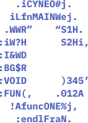

<p align="center">
  <a href="https://github.com/Magayaga/CyNeo">
    
  </a>
</p>

<h1 align="center">CyNeo</h1>

**CyNeo** is the **free and open-source** **modern screen-based text editor** for Unix-like computing systems or operating environments using a command line interface. It is the created and developed by [@magayaga](https://github.com/Magayaga). It is forked from [kilo](https://github.com/antirez/kilo) created and developed by [@antirez](https://github.com/antirez).

## Getting Start

```shell
# Download the CyNeo's code
$ git clone https://github.com/magayaga/CyNeo.git
$ cd CyNeo

# Run the CyNeo
$ make
```

## Copyright
Copyright 2023-2024 Cyril John Magayaga
